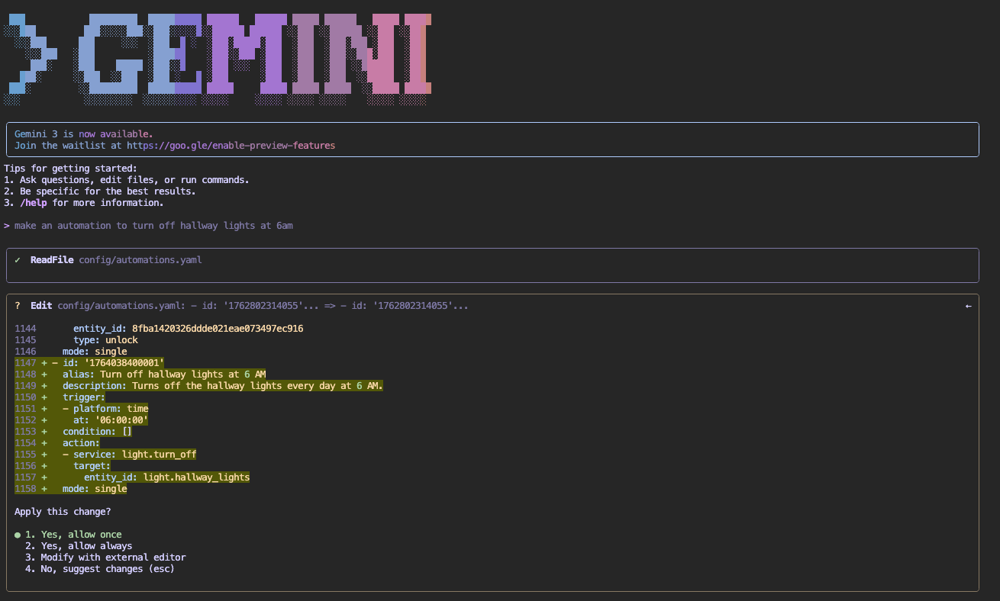

# Gemini CLI Add-on

This add-on provides a web-based terminal with the Google Gemini CLI pre-installed, allowing you to interact with Google's Gemini AI directly from your Home Assistant dashboard.

**Note:** This add-on is **not** an official Google product.

The add‑on supports two usage modes:
1. **Help mode (default)** – you can ask Gemini for information, explanations, or guidance about your Home Assistant configuration.
2. **Agentic editing mode** – when `allow_write_access` is set to `true`, Gemini can suggest and apply changes to your Home Assistant settings and automations, always showing the proposed edits for your confirmation.

## Features

-   **Web-based Terminal**: Access the Gemini CLI from any browser via Home Assistant Ingress.
-   **Persistent Authentication**: Log in once with Google, and your session is saved across restarts.
-   **Home Assistant Context**: The CLI runs with access to your `/config` directory, allowing you to easily reference your configuration files.

## Installation

1.  Add this repository to your Home Assistant Add-on Store.
2.  Install the "Gemini Terminal" add-on.
3.  Start the add-on.
4.  Click "Open Web UI" to access the terminal.

## Configuration

The add-on works out of the box with safe defaults. The only configuration option is:

### `allow_write_access` (Default: `false`)

Controls whether the Gemini AI can modify files in your Home Assistant configuration directory.

- **`false` (default)**: Read-only mode - AI can read files but cannot modify them
- **`true`): Write mode - AI can modify files after showing you the changes and getting confirmation

**To enable write access:**

1. Create a backup first (Settings → System → Backups)
2. Go to the add-on's Configuration tab
3. Set `allow_write_access: true`
4. Click Save and Restart
5. Check logs for: `[WARNING] WRITE ACCESS ENABLED!`

## Usage

**Authentication:** This add-on uses OAuth to connect to your personal Google account. The authentication tokens are stored securely in the Home Assistant host under `/config/gemini_auth/` and are persisted across restarts.
1. **First Run**: Open the web UI - the Gemini CLI will prompt you to log in
2. **Authentication**: Select "Login with Google" (option 1) and follow the OAuth flow
3. **Start Chatting**: Once authenticated, ask questions
- "Explain what this automation does"
- "My hallway lights are not coming on when I come home, why?"
- "Make an automation to turn the christmas tree on at 5pm"
